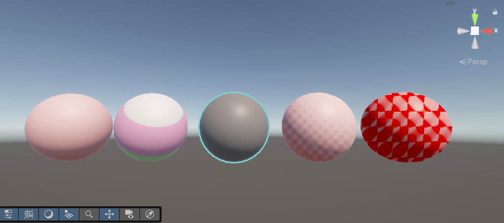

# はじめに
プログラムワークショップIVの管理用です

# 結果画像

- 工夫した点：イメージ春メインで作りました
- 最後の試す部分はsineの部分をtangentに切り替え形がより一層幾何学模様に見える用変数を調整しました

# 進め方

- 本リポジトリをforkしてください
- fork先のリポジトリを更新してください
- Unityのプロジェクトをsrc内で進めてください
- 結果を画面キャプチャして、画像としてリポジトリに追加して、上記のリンクから見られるようにしてください
- 完成したら本リポジトリのmainブランチにpull requestを投げてください
